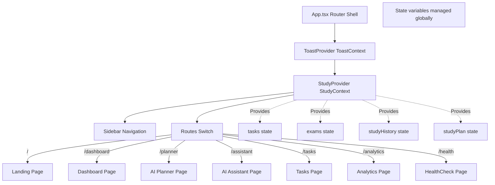

# StudyAI Planner Pro - Architecture & Technical Document

StudyAI Planner Pro is a production-grade React application compiled using Vite, written in TypeScript, and utilizing Tailwind CSS with Framer Motion. The application allows students to coordinate tasks, keep count of upcoming exam schedules, chat with an AI helper, and generate dynamic day-by-day study planners using the Google Gemini model series.

---

## 1. Frontend Component Hierarchy & State Modularity

The application shell wraps all routes in a React `ErrorBoundary` and registers global listeners for offline detection via the `OfflineBanner`. The routing configuration split bundles non-critical pages.

### Component Relationship Diagram:


---

## 2. State Management Flow

Application state is managed globally using a React Context pattern:
- **`StudyProvider` (`src/context/StudyContext.tsx`)**:
  - Manages localStorage persistence for `tasks`, `exams`, `chatMessages`, `plannerInput` parameters, `studyPlan`, and `studyPlanMetadata`.
  - Exposes state-mutating actions (e.g. `setStudyPlan`, `setStudyPlanMetadata`, `togglePlanTaskComplete`) to child screens.
  - Dynamically calculates progress statistics (completion percentage, study hours logged).
- **Theme Syncing**: Custom `useEffect` manages the sync of light/dark modes onto the document DOM root elements.

---

## 3. AI Request & Caching Flow

```mermaid
sequenceDiagram
    participant UI as UI Component (AIPlanner.tsx)
    participant Service as Service Layer (gemini.ts)
    participant Cache as Cache Layer (localStorage)
    participant API as Google Gemini API
    participant Fallback as Fallback Scheduler (gemini.ts)

    UI->>Service: fetchStudyPlanFromGemini(PlannerInput)
    Note over Service: Generate Cache Key (incorporates PROMPT_VERSION)
    Service->>Cache: getCachedPlan(cacheKey)
    alt Cache Hit (Deterministic Match)
        Cache-->>Service: Return StudyPlanResult (Source: 'cache')
        Service-->>UI: Return Result & Render 'From Cache' Badge
    alt Cache Miss
        Note over Service: Check Offline Status
        alt Navigator is Offline
            Service->>Fallback: generateLocalFallbackPlan(PlannerInput)
            Fallback-->>UI: Return Local Plan & Render 'Offline Fallback' Badge
        else Navigator is Online
            Note over Service: Check API Key
            alt API Key is Missing
                Service->>Fallback: generateLocalFallbackPlan(PlannerInput)
                Fallback-->>UI: Return Local Plan
            else API Key is Present
                Service->>API: HTTP POST /models/gemini-2.5-flash:generateContent
                alt API Response Valid
                    API-->>Service: Return JSON Plan (Schema v2)
                    Service->>Cache: cachePlan(cacheKey, result)
                    Service-->>UI: Return Result & Render 'AI Generated' Badge
                else API Error/Timeout (Exponential Retries)
                    Service->>Fallback: generateLocalFallbackPlan(PlannerInput)
                    Fallback-->>UI: Return Local Plan
                end
            end
        end
    end
```

---

## 4. Structured Output Schema

The Gemini model is forced to return valid JSON matching this schema:
```json
{
  "courses": [
    {
      "courseName": "Name of the course",
      "examDate": "YYYY-MM-DD"
    }
  ],
  "estimatedDifficulty": "easy" | "medium" | "hard",
  "schedule": [
    {
      "date": "YYYY-MM-DD",
      "tasks": [
        {
          "title": "Action-oriented task description",
          "subject": "Name of the course",
          "priority": "High" | "Medium" | "Low",
          "estimatedHours": 1.5,
          "revisionBlocks": ["subtopic 1", "subtopic 2"]
        }
      ]
    }
  ]
}
```

---

## 5. Caching & Versioning

- **Prompt Versioning**: Prompts are isolated in `src/services/prompts.ts` with `PROMPT_VERSION = 'v2'`.
- **Deterministic Key**: The caching key is derived from:
  `studyplan_cache:${PROMPT_VERSION}:${sortedSubjects}:${sortedDates}:${dailyHours}`
- **Auto-Invalidation**: Incrementing `PROMPT_VERSION` automatically shifts the cache key name, instantly invalidating stale legacy cached plans.

---

## 6. Adaptive Workload Scheduling & Fallback Scheduler

Both the AI prompt guidelines and the local fallback scheduler (`generateLocalFallbackPlan`) enforce these scheduling rules:
1. **Weekend Expansion**: Weekends (Saturday and Sunday) automatically scale daily hours allowance by `1.5x` (capped at 12 hours) to allocate study workloads to less busy periods.
2. **Revision Days**:
   - The day before an exam date is dedicated strictly to "Revision & Mock Practice" tasks.
   - Every 4th day of the generated schedule is designated as a "Synthesis Day" focusing on active recall, summary maps, and concept flashcards.

---

## 7. Structured Analytics Telemetry Logs

All planner events are logged under the prefix `[ANALYTICS]` in JSON format for production telemetry:
```json
{
  "event": "generation_started" | "generation_succeeded" | "generation_failed" | "fallback_used" | "cache_hit",
  "promptVersion": "v2",
  "cacheKey": "studyplan_cache:v2:...",
  "generationTimeMs": 1500,
  "source": "gemini" | "cache" | "fallback",
  "error": "Error message description if failed"
}
```
