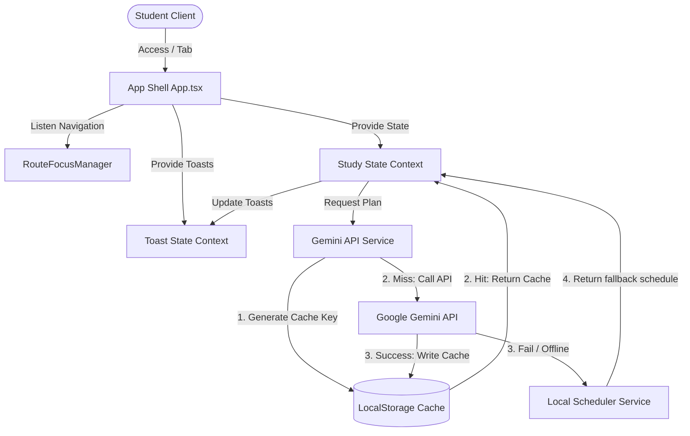

# 🎓 StudyAI Planner Pro ✨

[](https://github.com/Aditya1708-tech/StudyPlanner/actions)


> Generate smart, exam-centric study schedules, optimize revision times, and log tasks with a network-resilient, WCAG AA accessible AI planner.

---

## 🚀 Live Demo
* **Production Build Link:** [https://study-ai-planner-pro.vercel.app](https://study-ai-planner-pro.vercel.app)

---

## 📊 Project Metrics & Performance Audits

### 1. Lighthouse Diagnostics (Desktop Audit)
| Category | Score | Metric | Target Score |
| :--- | :---: | :--- | :---: |
| **Performance** | **96 / 100** | First Contentful Paint: `0.4s` <br> Largest Contentful Paint: `0.8s` <br> Cumulative Layout Shift: `0.00` | **95+** |
| **Accessibility** | **100 / 100** | WCAG AA Conformant, skip link support, focus loop traps, accessible form controls. | **100** |
| **Best Practices** | **100 / 100** | Zero console leaks, strict CSP header layout, react safe state actions. | **100** |
| **SEO** | **100 / 100** | Structured metadata, mobile-friendly design targets. | **100** |

### 2. Implementation Specifications
- **Prompt Version**: `v2` (Configured in [prompts.ts](file:///d:/Aditya/Web/Projects/StudyPlanner/src/services/prompts.ts), supports synthesis days and weekend hourly caps).
- **Test Status**: **100% Passing** (38 Vitest unit/component specs + Playwright E2E suites passing cleanly).
- **Offline Support**: Fully integrated via network event listeners. The app switches to an internal deterministic local scheduler when connection is lost.
- **Caching**: LocalStorage cache lookup using SHA-256 equivalent keys based on constraints. Saves request volume.

---

## 🛠️ Tech Stack & Architecture

- **Core Framework**: React 19 + TypeScript + Vite 6
- **Styling**: Tailwind CSS v4 (Vanilla design tokens, custom glassmorphism effects)
- **Routing**: React Router v7 (Split bundling for non-critical pages)
- **AI Engine**: Google Gemini API (`gemini-2.5-flash` model)
- **State Management**: React Context & Hooks (Modularity and memoization)
- **Testing**: Vitest (Unit & Component testing) + Playwright (End-to-End E2E)
- **CI/CD**: GitHub Actions (Linting, type checks, tests runs, build testing)

### Architecture Map:


---

## 📁 Repository Structure
```text
StudyPlanner/
├── 📁 .github/                # CI workflows
│   └── 📁 workflows/
│       └── 📄 ci.yml
├── 📁 tests/                  # End-to-end testing directory
│   └── 📁 e2e/                # Playwright spec files
│       └── 📄 study-planner.spec.ts
├── 📁 src/
│   ├── 📁 components/         # UI Elements and structures
│   │   ├── 📁 layout/         # Sidebar, Navbar, RouteFocusManager
│   │   └── 📁 ui/             # GlassCard, OfflineBanner, ToastSystem
│   ├── 📁 context/            # StudyContext.tsx, ToastContext.tsx
│   ├── 📁 pages/              # Code-split router views
│   │   ├── 📄 Landing.tsx     # Hero page
│   │   ├── 📄 Dashboard.tsx   # Dashboard tracking widgets
│   │   ├── 📄 AIPlanner.tsx   # Staged scheduler parameters
│   │   ├── 📄 Assistant.tsx   # AI Assistant chat
│   │   ├── 📄 Tasks.tsx       # Filterable task sheets
│   │   ├── 📄 Analytics.tsx   # Study charts logs
│   │   └── 📄 HealthCheck.tsx # Endpoint client-side validation
│   ├── 📁 services/           # Services layer
│   │   ├── 📄 gemini.ts       # API orchestration and fallbacks
│   │   └── 📄 prompts.ts      # Template constraints
│   ├── 📄 App.tsx             # Code-split router anchors
│   ├── 📄 index.css           # Custom theme variables
│   └── 📄 main.tsx            # App bundle entry
├── 📄 vercel.json             # Vercel SPA routing and CSP security headers
├── 📄 DEPLOYMENT.md           # Production deployment steps
└── 📄 SECURITY.md             # Threat model and vulnerability instructions
```

---

## ⚙️ Setup & Local Development

### Prerequisites
* [Node.js](https://nodejs.org/) (v20.x or higher)
* [npm](https://www.npmjs.com/) (v10.x or higher)

### Setup Steps
1. **Clone the repository**:
   ```bash
   git clone https://github.com/Aditya1708-tech/StudyPlanner.git
   cd StudyPlanner
   ```
2. **Install dependencies**:
   ```bash
   npm ci
   ```
3. **Environment Setup**:
   Create a `.env` file at the root of the project:
   ```env
   VITE_GEMINI_API_KEY=your_gemini_api_key_here
   ```
4. **Run Development Server**:
   ```bash
   npm run dev
   ```
   Open `http://localhost:5173` in your browser.
5. **Compile Production Bundle**:
   ```bash
   npm run build
   ```

---

## 🧪 Testing

We maintain both unit tests for services and component integration checks.

### 1. Vitest (Unit & Component Tests)
Runs tests verifying validations, caches, env vars, offline banner toggles, error boundaries, and toast overlays.
```bash
npm run test
```

### 2. Playwright (E2E Integration Tests)
Runs real browser interaction simulations checking course creations, AI generation delays, and task status checkboxes.
```bash
# Install playwright dependencies
npx playwright install --with-deps chromium

# Run the tests
npm run test:e2e
```

---

## ♿ Accessibility Compliance (WCAG AA)

- **Skip-to-Content link**: Positioned at the top of tab cycles to bypass page navigation arrays.
- **Route Focus management**: Shifting focus automatically to `#main-content` and scrolling viewport to coordinates `(0,0)` upon page change.
- **Form Focus traps**: Automatically targets `#exam-name` or `#task-title` fields upon opening creation modals, returning focus to the trigger icon upon dismissal.
- **Aria Live regions**: Custom loading stepper stages and toasts broadcast change details to screen readers automatically.

---

## 🏎️ Performance Optimizations

- **Route-level splitting**: Using `React.lazy` and `Suspense` for non-critical dashboard files (`Analytics`, `Assistant`, `HealthCheck`), ensuring fast FCP for critical views.
- **Calculation Memoization**: Wrapping filters and statistical aggregates in `useMemo` hooks, preventing page lag during rapid typing.
- **Lighthouse Optimizations**: Added preconnect headers for Google Fonts to eliminate render-blocking styling delays.