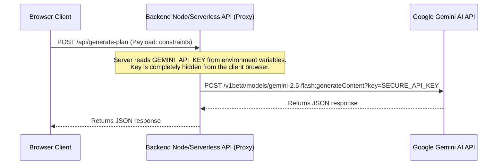

# Security Policy — StudyAI Planner Pro

This document details the security posture, vulnerability reporting mechanisms, and API key management guidelines for the StudyAI Planner Pro application.

---

## 1. Supported Versions

Security updates are actively applied to the following software versions:

| Version | Supported | Status |
| :--- | :--- | :--- |
| **v1.0.0** (Current Sprint) | Yes | Active Development & Patches |
| **< v1.0.0** | No | Deprecated |

---

## 2. Reporting a Vulnerability

If you discover a security issue or vulnerability in this repository, please do **not** open a public GitHub issue. Instead, report it privately to ensure the safety of the application:

1. **Email**: Send a detailed report to `security@studyai-planner-pro.local` (or the repository maintainer's email).
2. **Details**: Include a description of the vulnerability, steps to reproduce (including payloads or request headers), and potential impacts.
3. **Response**: We aim to acknowledge reports within 48 hours and provide a resolution timeframe within 7 business days.

---

## 3. Environment Variable & API Key Handling

### Client-Side Key Exposure Risk
In static Single Page Applications (SPAs) built with bundlers like Vite, all environment variables prefixed with `VITE_` (such as `VITE_GEMINI_API_KEY`) are compiled directly into the production JS bundle. 
> [!CAUTION]
> This means that anyone inspecting the network traffic in their browser DevTools or reading the downloaded JavaScript sources can easily retrieve the API key.

### Mitigation Strategies Implemented:
1. **Local Development Mode**: The key is stored in a local, git-ignored `.env` file (`VITE_GEMINI_API_KEY=AIzaSy...`).
2. **Graceful Fallback**: If the key is missing (or fails to call), the system automatically degrades to a local offline scheduling algorithm rather than crashing, keeping the service active for the client.
3. **Content Security Policy (CSP)**: The `connect-src` header inside [vercel.json](file:///d:/Aditya/Web/Projects/StudyPlanner/vercel.json) restricts API endpoints strictly to Google Gemini (`generativelanguage.googleapis.com`) and data APIs (`jsonplaceholder.typicode.com`), preventing malicious scripts from exfiltrating the key to third-party endpoints.

---

## 4. Recommendation for a Future Backend Proxy (Production Standard)

To achieve enterprise-grade security and completely protect the Gemini API key from client-side inspection, we recommend transitioning the AI Planner API request pipeline to a **Backend Proxy** model.

### Target Architecture Flow:

### Benefits of the Backend Proxy:
1. **Zero Key Exposure**: The key remains server-side, stored securely in Serverless Environment variables (Vercel, AWS Lambda, etc.) and is never sent to the browser.
2. **Rate Limiting**: Implementation of IP-based rate limiting (using libraries like `express-rate-limit` or Vercel middleware) to prevent brute-force exhaustion of your Gemini API limits.
3. **Caching Optimization**: Server-side Redis caching to store plans across multiple users, optimizing request density and reducing API costs.
